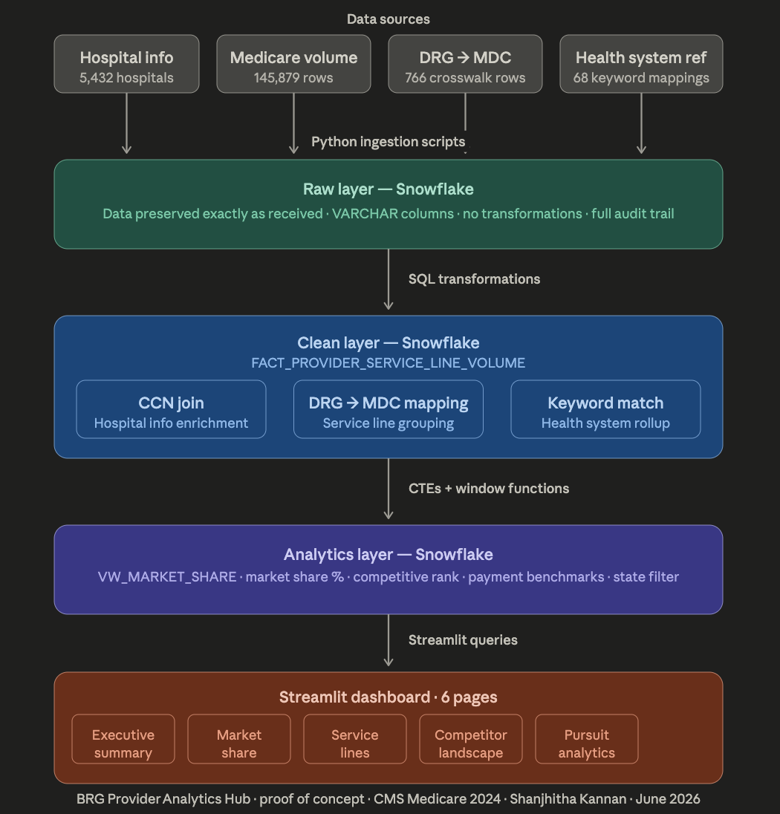
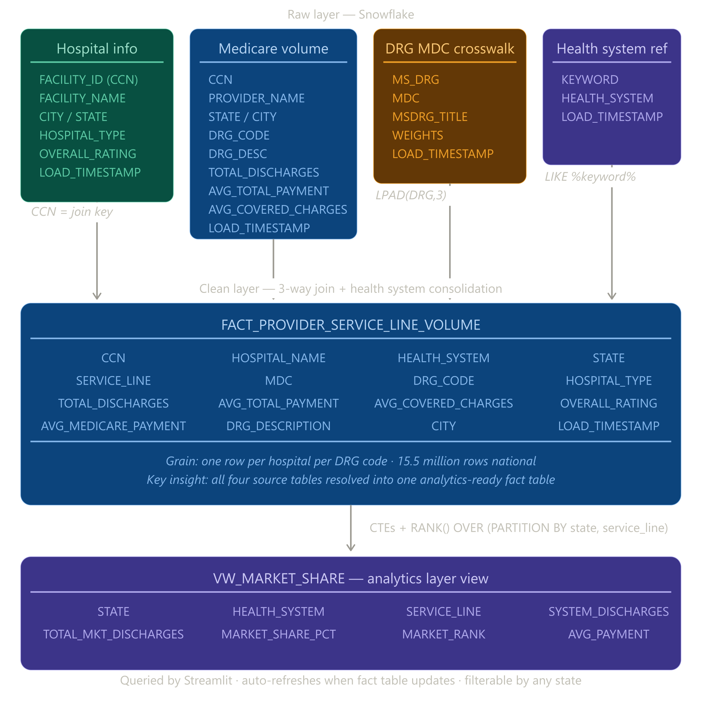

# BRG Provider Analytics Hub
### A Healthcare Market Intelligence Proof-of-Concept

Built by **Shanjhitha Kannan** · BRG Summer Associate · June 2026

---

## What This Is

A proof-of-concept **Provider Analytics Hub** that demonstrates how healthcare market share data can be transformed into consulting intelligence. Built to mirror the analytical workflow of BRG's internal healthcare analytics initiatives.

The hub answers two core questions a healthcare consultant asks before walking into a client meeting:

1. **Where does this provider stand in the market?** (Market Share Analytics)
2. **Where are the consulting opportunities?** (Pursuit Analytics)

---

## Architecture


---

## Data Sources

| Dataset | Source | Rows | Key Fields |
|---|---|---|---|
| Medicare Inpatient Hospitals by Provider & Service (2024) | [data.cms.gov](https://data.cms.gov/provider-summary-by-type-of-service/medicare-inpatient-hospitals/medicare-inpatient-hospitals-by-provider-and-service) | 145,879 | CCN, DRG code, total discharges, avg payments |
| Hospital General Information (2024) | [data.cms.gov/provider-data](https://data.cms.gov/provider-data/dataset/xubh-q36u) | 5,432 | Facility ID (CCN), name, city, state, type, overall rating |
| MS-DRG MDC Crosswalk FY2024 | [NBER / CMS IPPS Final Rule](https://data.nber.org/drg/csv/drgweight2024FR.csv) | 766 | DRG code, MDC code, DRG title |
| Health System Reference Table | Curated (this repo) | 68 | Keyword, canonical health system name |

All data is **publicly available** from CMS (Centers for Medicare & Medicaid Services). No proprietary or client data is used.

---

## Key Analytical Concepts

### Market Share Formula
```
Market Share % = (Provider Discharges / Total Market Discharges) × 100

Numerator   = one health system's discharges in one state + service line
Denominator = ALL providers' discharges in that same state + service line
```

### Service Line Mapping
Medicare data contains 500+ granular DRG procedure codes. These are rolled up to service lines using the official CMS MDC (Major Diagnostic Category) classification:

| MDC | Clinical Group | Service Line |
|---|---|---|
| 05 | Circulatory System | Cardiology |
| 08 | Musculoskeletal | Orthopedics |
| 01 | Nervous System | Neurology |
| 17 | Neoplasms | Oncology |
| 13, 14, 15 | Female Reproductive / OB / Neonatal | Womens Health |
| 19, 20 | Mental Health / Substance Use | Behavioral Health |

### Health System Consolidation
Individual hospitals are grouped under parent health systems using keyword matching against a reference table. This is a proof-of-concept approach — production systems use a licensed CCN-to-health-system crosswalk from vendors like Definitive Healthcare.

---

## Snowflake Data Model



---

## SQL Concepts Used

| Concept | Where Used | Purpose |
|---|---|---|
| CTEs (Common Table Expressions) | Clean layer, market share view | Break complex logic into readable named steps |
| LEFT JOIN | All joins | Preserve all Medicare rows even without matches |
| LPAD | DRG code join | Standardize '3' → '003' for consistent matching |
| CASE WHEN | MDC → service line mapping | Translate clinical codes to business language |
| RANK() OVER (PARTITION BY) | Market share view | Rank each system within each state+service line |
| COALESCE | Health system mapping | Replace NULL with 'Independent / Other' |
| CAST | Clean layer | Convert VARCHAR volumes to FLOAT for calculations |
| LIKE with wildcards | Health system reference join | Pattern match hospital names to parent systems |

---

## Project Structure

```
brg_analytics/
├── dashboard.py                    # Streamlit dashboard (6 pages)
├── load_to_snowflake.py            # Load mock data to Snowflake
├── load_real_data.py               # Load CMS datasets to Snowflake
├── load_drg_crosswalk.py           # Load DRG-MDC crosswalk
├── load_reference.py               # Load health system reference table
├── health_system_reference.csv     # 68 health system keyword mappings
├── RAW_provider_volume_dirty.csv   # Mock dirty data (learning exercise)
├── requirements.txt                # Python dependencies
├── BRG_Analytics_Worksheet.sql     # Fully annotated Snowflake SQL
└── README.md                       # This file
```

---

## Setup Instructions

### Prerequisites
- Python 3.12+
- Snowflake account (free trial at snowflake.com)
- CMS data files (see Data Sources section above)

### Installation

```bash
git clone https://github.com/Shanjhitha/brg-provider-analytics-hub.git
cd brg-provider-analytics-hub
pip install -r requirements.txt
```

### Environment Variables

Never hardcode credentials. Set these in your terminal:

```bash
export SNOWFLAKE_USER='your_username'
export SNOWFLAKE_PASSWORD='your_password'
```

Or add permanently to `~/.zshrc` on Mac.

### Snowflake Setup

Run `BRG_Analytics_Worksheet.sql` in your Snowflake worksheet in order:
1. Create database and schemas
2. Create raw tables
3. Load data via Python scripts
4. Run clean layer transformation
5. Create analytics view

### Run Dashboard

```bash
streamlit run dashboard.py
```

Open `http://localhost:8501` in your browser.

---

## Known Limitations

| Limitation | Detail | Production Solution |
|---|---|---|
| Medicare FFS only | Excludes Medicaid, commercial, Medicare Advantage | Add all-payer claims data |
| Keyword matching | May miss recent M&A affiliations | License CCN crosswalk from Definitive Healthcare |
| ~35-40% Independent/Other | Hospitals not matching any keyword | Complete CCN-to-system mapping |
| Single year snapshot | No longitudinal trend analysis | Load multiple years of CMS data |
| Small cell suppression | CMS suppresses DRGs ≤10 discharges | Use facility-level data where available |
| State-level market definition | May not reflect true geographic competition | Use HSA/HRR market definitions |

---

## AI Assistance Disclosure

This project was built with **significant AI assistance from Claude (Anthropic)**.

### What AI helped with:
- Streamlit dashboard layout and CSS styling (~767 lines of dashboard code)
- Python boilerplate for Snowflake connections and data loading
- Plotly chart formatting and color schemes
- SQL query structure and syntax
- Generating the dirty mock dataset with realistic data quality issues
- Writing this README

### What I designed and decided independently:
- **Market share methodology** — defined numerator/denominator logic before any code was written
- **Data model design** — fact table grain, primary key, column rationale
- **Core SQL logic** — wrote the CTE market share query independently; 
- **Dataset narrative design** — decided which patterns to build in (declining orthopedics, surging cardiology, etc.)
- **Architecture decisions** — three-layer pipeline, why LEFT JOIN over INNER JOIN, why MDC crosswalk over manual mapping, why reference table over hardcoded CASE WHEN
- **Business framing** — proof-of-concept scope, Virginia as demo market, national scalability
- **Critical pivots** — pushed back on mock data and insisted on real CMS data; identified geographic tension in the dataset; questioned hardcoded mappings

### How to think about this:
AI accelerated implementation. All analytical thinking, business judgment, and architectural decisions were made by the summer associate.

---

## What This Demonstrates

This proof-of-concept shows the complete workflow from raw data to consulting intelligence:

```
Raw CMS data
    ↓ Python ingestion
Snowflake RAW layer (preserve exactly as received)
    ↓ SQL transformation
Snowflake CLEAN layer (standardize, join, validate)
    ↓ CTE-based aggregation
Snowflake ANALYTICS layer (market share, rankings)
    ↓ Streamlit visualization
Dashboard (6-page interactive hub)
    ↓ Business interpretation
Consulting insights (pain points, opportunities, discussion guide)
```

In a production BRG engagement, this same architecture would use:
- 50-100 datasets instead of 3
- Licensed vendor data (Definitive Healthcare, IQVIA) instead of public CMS
- Automated refresh pipelines instead of manual Python scripts
- Deployed Streamlit or Tableau instead of localhost

---

*Built as a learning exercise to understand the data-to-consulting-intelligence workflow. Not for client distribution.*
